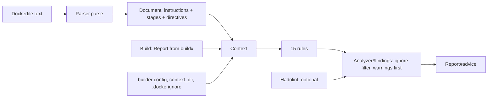

# Dockerfile advice: parser, context and rules

`lib/dash/dockerfile/` reads the Dockerfile a deploy just built and prints advice next to the deploy report. It runs from two places: `dash doctor`, statically, with no build and no SSH, and `Dash::Report#analyze!` (lines 86-103) after a build, where the buildx measurements upgrade a static hint into "this cost you 84.1 seconds" (`analyzer.rb`, lines 1-5).

**The safe failure direction, stated once.** Advice is a courtesy printed next to a deploy, and the authority on whether a Dockerfile builds is BuildKit, not this parser. So a file the parser cannot make sense of must produce *fewer* findings, never an exception (`parser.rb`, lines 7-9). Every deliberate approximation below leans that way: an unterminated heredoc consumes nothing, `.dockerignore` negations are skipped rather than applied so a path this says is covered might still ship (`dockerignore.rb`, lines 3-5), a hadolint that misbehaves becomes one informational finding, and `Dash::Report#analyze!` itself runs inside `Dash::Cli::Base#guarded_report`.

## Parser (`lib/dash/dockerfile/parser.rb`, 199 lines)

Line-oriented, because that is how BuildKit reads it. `#parse` (lines 29-37) does four things in order: read the leading directives, join continuations and pull in heredocs into instructions, group instructions into stages, mark the shipped ones.

| Constant | Source | Purpose |
|---|---|---|
| `DIRECTIVE` | `/\A#\s*(?<name>syntax\|escape)\s*=\s*(?<value>\S+)\s*\z/i` | only in the comment block at the very top; after the first instruction a `# syntax=` line is an ordinary comment (lines 42-43) |
| `COMMENT` | `/\A\s*#/` | dropped between continuation lines, which is BuildKit's own convention for annotating a long RUN |
| `INSTRUCTION` | `/\A\s*(?<name>[A-Za-z]+)(?:\s+(?<rest>.*))?\z/m` | `/m` so a heredoc body joined with `\n` stays in `rest` |
| `FLAG` | `/\A--(?<key>[a-zA-Z][\w-]*)=(?<value>(?:"[^"]*"\|'[^']*'\|\S)*)\s*/` | leading `--key=value` flags, repeated keys all kept (`extract_flags`, lines 148-157) |
| `HEREDOC` | `/<<-?\s*(?<quote>["']?)(?<delimiter>[A-Za-z_]\w*)\k<quote>/` | the quoted forms change how BuildKit expands the body, not where it ends |
| `STAGE_NAME` | `/\A(?<base>\S+)(?:\s+AS\s+(?<name>\S+))?\z/i` | splits `FROM base AS name` |
| `Stage::IMAGE_REF` | `%r{\A(?<image>(?:[^/@\s]+/)*[^:/@\s]+)(?::(?<tag>[^@\s]+))?(?:@(?<digest>\S+))?\z}` | the tag is only what follows a colon in the **last** path segment, so a registry port stays in the image name |
| `Stage::INTERPOLATION` | `/\$\{?\w+\}?/` | an ARG-pinned tag is not an unpinned base |

### Grammar table

Every form the parser is known to handle or deliberately approximate. "Safe direction" says what the harm is when this branch is wrong. Test citations are `test/dockerfile/parser_test.rb` unless another file is named.

| Form | Example | Result | Safe direction | Tested |
|---|---|---|---|---|
| Lowercase keyword | `from alpine` | upcased to `FROM` (`build_instruction`, lines 139-146) | — | yes — `:4` |
| Comment / blank line | `# note`, `` | skipped, but still counted towards the line number advice prints | a wrong line number sends the operator to the wrong line | yes — `:10` |
| Backslash continuation | `RUN a \` + `b` | joined into one instruction, reported at its **first** physical line | — | yes — `:17` |
| `# escape=\`` directive | backtick continuations | `parse` reads the directive first and passes the character down (lines 30-31) | — | yes — `:29` |
| `# syntax=` directive | `# syntax=docker/dockerfile:1` | captured into `directives`, not an instruction | — | yes — `:35` |
| Comment between continuation lines | `RUN a \` + `# why` + `&& b` | the comment is dropped from the command (`join_continuations`, line 90) | — | yes — `:83` |
| Leading flags | `COPY --from=build --chown=1:1 /a /b` | into `flags`, stripped from `args` | — | yes — `:42` |
| Repeated flag | two `--mount=` on one RUN | every value kept; `#flag(key)` returns the first | a rule reading only the first would miss a cache mount — `NoCacheMount` reads `Array(flags["mount"])` | yes — `:59` |
| Heredoc, bare delimiter | `RUN <<EOF` … `EOF` | body appended to `args`, line breaks kept so each body line is its own shell command | — | yes — `:65` |
| Heredoc, quoted delimiter | `RUN <<'EOF'` | same; the quotes only change BuildKit's expansion | — | yes — `:74` |
| Heredoc body with `\` continuation | `apt-get install \` + `curl` | the two lines are joined into one command before the body is stored (`heredoc_commands`, lines 129-137) | unjoined, apt-hygiene would read `curl` as a segment with no apt operation | yes — `test/dockerfile/analyzer_test.rb:309` |
| **Unterminated** heredoc | `RUN <<EOF` with no `EOF` | nothing is consumed; the rest of the file still parses (`append_heredocs`, lines 107-125) | the alternative folds the whole file into one instruction and loses every later finding | yes — `:157` |
| Heredoc lookalike as a shell word | `RUN echo '<<EOF'` | same as unterminated: consumes nothing | — | yes — `:157` (quoted-token case) |
| Two heredocs, second delimiter missing | `RUN <<A <<B` with only `A` closed | **neither** is consumed — the recovery returns the method-entry index, not the cursor | consuming the first would leave the file mid-heredoc | yes — `:164` |
| JSON exec form | `RUN ["bundle","install"]` | `#argv` parses it; `#shell_command` joins with spaces | a false positive needs shell metacharacters inside one argv element, and the two rules that could trip (`curl-pipe-shell`, `inline-env-blob`) are informational — see `review/dockerfile-parsing.md` | yes — `:90`, `:214` in the analyzer test |
| Malformed JSON exec form | `RUN ["a",` | `#argv` is nil, `#json?` false, treated as the shell form | BuildKit would reject the file; the analyzer must not raise with it | no dedicated test |
| `FROM` with tag / digest / `AS` | `FROM ruby:3.4@sha256:… AS build` | pulled apart into `image`, `tag`, `digest`, `name` | — | yes — `:130` |
| Registry with a port | `FROM localhost:5000/app` | `5000/app` stays in the image; there is no tag | reading `5000/app` as a tag would make `latest-base` silent on an untagged base | yes — `:150` |
| Interpolated tag | `FROM ruby:$RUBY_VERSION` | `interpolated_tag?`, so `latest-base` stays quiet | — | yes — `:143` |
| Interpolated image, explicit `:latest` | `FROM $REGISTRY/app:latest` | still warns — interpolation in the **image** does not suppress it | otherwise a registry variable silences a real unpinned base | yes — `test/dockerfile/analyzer_test.rb:184` |
| `ARG` before the first `FROM` | — | belongs to no stage (`stage` stays nil) | — | yes — `:107` |
| Stage inheritance | `FROM build AS x` | only an explicit `AS` name can be inherited from; `stage-N` labels are dash's own | a generated label colliding with a base name would mark the wrong stage shipped | yes — `:173` |
| Shipped-stage walk | last stage + its transitive bases | `mark_shipped` (lines 190-198); a stage reached only by `COPY --from=` is not shipped | — | yes — `:116`, `:123` |
| Empty file | `""` | parses to no instructions and no stages, rather than raising | — | yes — `:179` |

## Context (`lib/dash/dockerfile/context.rb`, 147 lines)

Everything a rule is allowed to look at, plus the shared predicates, so "what counts as a dependency install" has one answer.

- `DEPENDENCY_INSTALLS` (lines 11-24) is **12** pattern/cache-target pairs: bundler, npm, yarn, pnpm, bun, pip, poetry, go mod, cargo, composer, mix, dotnet. Each target is a single pasteable path (`/usr/local/bundle/cache`, `/go/pkg/mod`) because it is printed straight into a `--mount=type=cache,target=…` suggestion.
- `APT_OPTIONS` = `/(?:-[^\s;&|]+(?:\s+[^-\s;&|][^\s;&|]*)?\s+)*/` steps over an option and, optionally, one separate non-dash value, so `apt-get -y install` and `apt-get -t bookworm-backports install` both match. Shell separators are excluded from both the option token and its value, so `apt-get -y && install` is not an apt install — and, just as important, does not raise inside apt-hygiene.
- `build_step_for` (lines 95-109) matches a Dockerfile instruction to a buildx vertex. buildx expands `${…}` in the vertex name, so an exact match is not always available: candidates are ranked `[exact match, shared prefix length, seconds]`, and a non-exact winner must still share `MINIMUM_STEP_MATCH = 12` characters. Seconds break the tie, so a multi-platform build quotes the slowest platform's number. `same_stage?` (lines 129-131) accepts a vertex with no stage name **only** when the Dockerfile has exactly one stage — buildx omits the label only there.
- `busted_by_broad_copy?` (lines 86-90) lets `uncached-install` defer to `copy-before-install` rather than report the same slow step twice.

## The rules (`lib/dash/dockerfile/rules/`)

`Analyzer::RULES` holds **15** rules, in this order — which is also the order findings appear within each severity group (`analyzer.rb`, lines 50-54: warnings first, then informational, each group in rule order):

| # | Rule id | Severity | Needs a build? | What it looks at |
|---|---|---|---|---|
| 1 | `copy-before-install` | warn | no (quotes seconds when there is one) | a broad copy above a dependency install in the same stage |
| 2 | `context-size` | warn | **yes** | `build.context_bytes > 50_000_000` |
| 3 | `missing-dockerignore` | warn | no | a local context directory with no `.dockerignore` |
| 4 | `dockerignore-gaps` | warn when the context is big, else info | no | `.git` always; `node_modules tmp storage coverage log .env*` only when present |
| 5 | `latest-base` | warn | no | untagged or `:latest` base, excluding `scratch`, digests, interpolated tags and stage names |
| 6 | `secret-in-build-arg` | warn | no | `ARG`/`ENV` names matching `/(PASSWORD\|SECRET\|TOKEN\|_KEY)\b/i`, minus `SECRET_KEY_BASE_DUMMY` |
| 7 | `single-stage-build-deps` | warn | no | build tooling installed when there is only one stage |
| 8 | `apt-hygiene` | info | no | shipped stages only; per shell segment |
| 9 | `cache-busting-arg` | info | no | an `ARG` whose name looks commit-scoped, referenced before the last install |
| 10 | `cache-export-cost` | info | **yes** | `mode=max` where the export took over 20% of total step seconds |
| 11 | `curl-pipe-shell` | info | no | a download piped or process-substituted into a shell |
| 12 | `inline-env-blob` | info | no | more than 20 leading `NAME=value` assignments on a RUN |
| 13 | `no-cache-mount` | info | no | an install with no `--mount=…type=cache` |
| 14 | `uncached-install` | info | **yes** | an install over 10s uncached that no broad copy explains |
| 15 | `root-user` | info | no | the final stage sets no `USER` |

Each rule is a `Rules::Base` subclass with one public `#findings`, no IO and no ordering assumptions about its siblings (`base.rb`, lines 4-5). The id is derived from the class name (`name.demodulize.underscore.dasherize`), so **renaming a rule class renames a value an operator wrote in `report: ignore:`**. `Analyzer#findings` drops ignored ids after the rules run, so an ignored rule still executes.

`Rules::Base` requires `active_support/core_ext/string/inflections` explicitly (line 2), because `#underscore` is what derives every id and the gem cannot rely on a host app having loaded it.

## hadolint (`lib/dash/dockerfile/hadolint.rb`, 75 lines)

Optional supplement, run only when `report: hadolint:` is not `false` **and** the binary is on `PATH`. `available?` (lines 21-26) walks `PATH` itself rather than shelling out, so a directory with a space or a semicolon in it cannot turn a lookup into a command. `Open3.capture2(EXECUTABLE, "--format", "json", "--no-fail", @file)` — argv, no shell; `--no-fail` keeps hadolint's exit status out of the deploy.

Four outcomes, and the wording distinguishes them (lines 34-51):

| Outcome | Finding |
|---|---|
| not on `PATH` | `[]` — nothing at all |
| blank stdout | `[]` — no findings, not a failure |
| non-zero exit, or any non-`JSON::ParserError` exception | one info finding: `hadolint could not run (…)` |
| unparsable JSON, or valid JSON that is not an array | one info finding: `hadolint output could not be parsed (…)` |

Only `error` maps to `:warn` (`SEVERITIES`); every other hadolint level is `:info`, so a style note never competes with a measured finding. `path:` is what findings print (the operator's own `builder: dockerfile:`); `file:` is the resolved on-disk path that actually runs — the two differ whenever a deploy analyses its git clone rather than the working tree.

## Invariants

- No rule and no parser branch may raise into a deploy; the analyzer's caller is `guarded_report`, but the rules are expected not to need it — `test/dockerfile/analyzer_test.rb:303` pins the one input (`apt-get -y && install`) that used to.
- A rule id is a public config value. Changing one is a breaking change to an operator's `deploy.yml`.
- Measured rules stay silent without a build report, so `dash doctor` and a `--skip-push` deploy print the static half only.
- `Instruction#to_s` is the string compared against a buildx vertex name; it collapses whitespace (`gsub(/\s+/, " ")`) for that reason.

## Related

- [../reports/summary.md](../reports/summary.md) — where the findings are printed, saved and compared
- [../review/dockerfile-parsing.md](../review/dockerfile-parsing.md), [../review/dockerfile-rules.md](../review/dockerfile-rules.md)
- [../lode-map.md](../lode-map.md)
