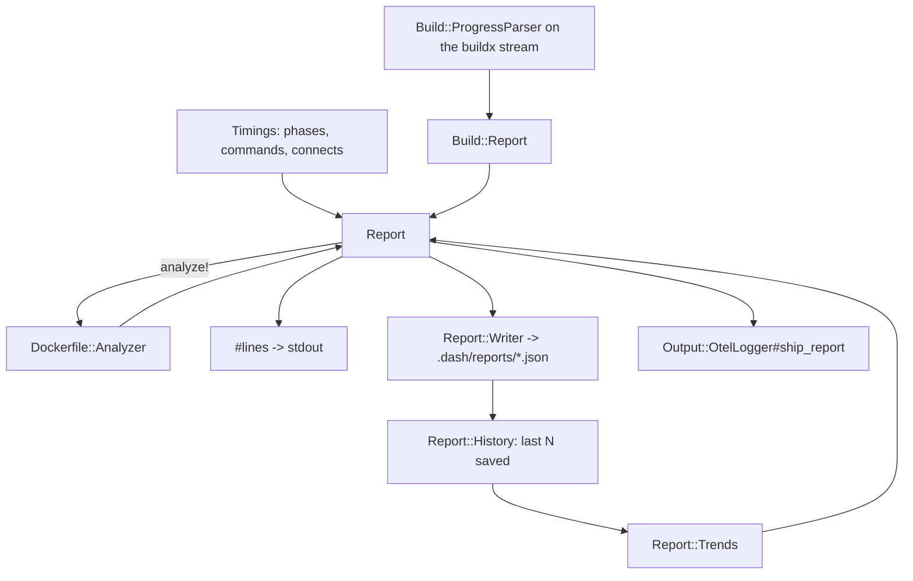

# Deploy reports: measure, render, save, compare

Every `dash deploy` prints a phase table, splices the build's own rows under the build phase, prints the Dockerfile and trend advice under that, and saves the whole thing as JSON under `.dash/reports`. `dash report` reads those files back and re-renders them.

## The lifecycle, in `Dash::Cli::Base`

`print_runtime` (lines 146-162) wraps a whole command and nests: `setup` calls `deploy`, so each level reports its own total but only the outermost — depth zero — finalises the report. Its `rescue` stores the error on `@report_error` so the saved report says how the run ended, and re-raises.

`finish_report` (lines 167-178) runs three steps, each guarded on its own so a half that fails does not take the other down: build the `run` hash and append the trend findings, print `DASH.report.lines`, write the JSON. `guarded_report` (lines 248-254) rescues `StandardError`, prints one yellow `Deploy report unavailable: <class>: <message>`, and returns its `fallback`.

The `run` hash (`report_run`, lines 182-190) is what both the file and the trend rules see, so they cannot disagree: `command`, `service`, `destination`, `version`, `started_at` (UTC ISO8601), `runtime`, `status`, and `error` when there is one.

**`status` describes the frame that finalised the report.** A `post-deploy` hook failure in a plain `dash deploy` leaves the report `succeeded`, because the hook fires outside `print_runtime` (`Dash::Cli::Main#deploy`, line 69) — the image was built and the containers booted, and calling that run failed would make the report disagree with the servers. Under `dash setup` the same hook fires *inside* the outer `print_runtime`, so a `HookError` there sets `@report_error` before the deferred report is written and that run is recorded `failed`.

## `Dash::Report` (`lib/dash/report.rb`, 170 lines)

Owns the rendering, because the build rows have to be spliced into the middle of the table and `Timings` has no business knowing what a buildx vertex is.

- `#lines` (67-77) takes the timing table, inserts the build rows after `build_entry`'s row (by index, `timings.index_of`), and appends the advice. With no `build_entry` the rows go at the end.
- `#build_lines` (113-125) is the build block: a context row, the `SLOWEST_STEPS = 5` slowest uncached instruction steps, `cached steps N of M`, an export+push row, then the failed steps **deduped by `[label, error]`** — a multi-platform build fails the same step once per platform with the same message, and that is one row; two different steps with one shared message are two.
- `#context_row` (147-149) prints `n/a` rather than `0.0s` when the transfer has a size but no duration, which is what a build killed between the `transferring context:` line and its `DONE` leaves behind.
- `#advice_rows` (130-136) prints `severity  location  message`, with the suggestion on its own line under it. Colour (`SEVERITY_COLORS` — `:warn` only) is applied only when `$stdout.tty?`, so a piped or asserted report is the same text without escape codes.
- `#to_h` (59-65) stamps `schema: SCHEMA` (1) and `dash_version`, merges the caller's `run` facts, and records `build_phase` as the **index** of the build entry, so a reader can put the build rows back without matching on a phase name dash is free to reword. `.compact` drops nils, so a run with no build has neither `build` nor `build_phase`.
- `#from_h` (39-48) rebuilds all of that. The entries come back parentless — their counters are already the subtree totals `#to_h` computed, and re-nesting would roll them up twice (`Timings.from_h`, lines 39-41).
- `#analyze!` (86-103) resets `@advice` **before** either early return, returns quietly when `report: advice: false` or when the Dockerfile is not there (a `--skip-push` deploy never looks at one), and otherwise runs the analyzer against `build_directory` — the git clone for a `push`, the working directory for a `dev` build that never clones.

## `Dash::Build` (`lib/dash/build/`)

`ProgressParser` (136 lines) is an SSHKit interaction handler on `docker buildx build --progress=plain`, so it sees the bytes SSHKit was already printing: no second process, no `docker buildx history`, no extra command. The stream arrives in chunks split on packet boundaries rather than newlines, so `#on_data` buffers and parses only whole lines; `#finish` (51-60) parses the trailing line a killed command leaves without a newline. Everything is behind a `Mutex`, and a parse error is captured on `@error` and stops the parsing rather than raising into the build — the caller reports it once and keeps what was collected.

Vertex lines are `#<number>[ rest]`. `#build_step` (87-104) classifies the first line for a vertex: a `STEP` match makes it `:instruction` (or `:from`), `INTERNAL` makes it `:context` or `:metadata`, `exporting cache` makes it `:cache_export`, and `exporting`/`pushing`/`writing image` makes it `:export`. Later lines are events: `DONE` (the last one wins, because buildx re-reports it per platform), `CACHED`, `ERROR`, `transferring context:` — decimal units, so `25.18MB` is 25,180,000 bytes — and `pushing … done`, which **accumulates** into `@push_seconds`.

`Build::Report` (104 lines) derives everything else. `dockerfile_steps` are the vertices with an ordinal; `failed_steps` (82-84) narrows `errors` to dockerfile steps and exports, because BuildKit reports a cache-import miss as an ERROR on its own vertex and the first build against a fresh cache always has one. `#from_h` restores only the steps and the push seconds and recomputes the rest, so a hand-edited file cannot claim a total its own steps do not add up to.

## `Dash::Report::History` (94 lines)

The saved reports for one destination, newest first. Everything is best-effort: the directory is the operator's, a report may be half-written, and a future dash may write a schema this one does not know — none of that is worth a word on a deploy, so an unreadable file is skipped in silence (`entry_for`'s bare `rescue StandardError`, lines 66-67).

`entry_for` (59-68) admits a file only when it parses to a Hash, its `schema` equals `Dash::Report::SCHEMA`, its `destination` equals the one asked for, and `well_formed?` passes.

`well_formed?` (76-85) checks the top-level fields the writer always sets by shape — `phases` a list of hashes, and `advice`/`build`/`error`/`runtime` either absent or the right type — and then applies the test that matters for everything nested: it renders the document (`Dash::Report.from_h(document).lines`). A raise there lands in the same rescue that skips unreadable files. `runtime` and `error` get their own type checks because rendering never reads them and the trend rules and `dash report`'s `error_note` do.

`order_key` (52-57) sorts by filename, not by the timestamp inside — the name is what an operator sorts by, and a report whose body could not be read cannot be ordered by its contents. A trailing `-N` collision suffix is parsed out and compared **numerically**, so `X.json` < `X-2.json` < `X-10.json`; byte order would put the unsuffixed name last and make the older run look newest. The suffix is unambiguous because the name ends in the command and no command is a number.

`prune(count)` deletes everything past the newest `count` **of this destination**; other destinations have their own budget, so a staging deploy cannot age out production's history.

## `Dash::Report::Writer` (142 lines)

One JSON file per run, written whether the run succeeded or failed — the run an operator most wants afterwards is the one that went wrong.

The name is `<started_at with colons as dashes>-<destination>-<command>.json`, every part through `safe` (`/[^\w.-]+/` → `-`), because a destination is an operator-supplied string and a command can carry a subcommand.

`publish` (47-58) writes the content to a private `.<base>.<pid>.tmp` scratch file first, then claims a name. **The name and the content always arrive together**: `File.link` publishes a file that is already complete, atomically, and only if the name is free — `Errno::EEXIST` moves to the next `-N` suffix. A filesystem without hard links falls back to `created` (76-82), which claims with `O_EXCL` (never replaces) and then renames the completed scratch onto that placeholder. The placeholder is the one thing that could be orphaned, so `filled` (95-101) removes it in an `ensure` gated on *the scratch file still existing* — the rename consumes the scratch, so the filesystem itself answers "did the publish happen", with no flag that an interrupt could leave out of sync. `publish`'s own `ensure` removes the scratch. Both cleanups survive `Interrupt`, which is not a `StandardError`.

`write` returns nil when `keep.zero?`, and `prepare_directory` (137-141) writes a `*`-plus-`!.gitignore` file next to the reports unless one already exists, so a project that commits `.dash/` does not start committing a report on every deploy.

## `Dash::Report::Trends` (129 lines)

Compares this run with the last few saved ones. Everything it produces is `:info` at `location: "deploy history"` — a slow deploy is a fact about today, not a defect.

`comparable` (43-48) keeps only documents whose `command` equals this run's **and** whose `status` is `"succeeded"`, then takes the first `WINDOW = 5`. So the window is over retained, same-command, successful reports — a destination whose last three deploys failed has no trend. Fewer than `MINIMUM_HISTORY = 3` of those and `#findings` returns `[]`.

| Rule | Fires when |
|---|---|
| `trend-build` | this run's `Build and push app image` phase > 1.5× the median of at least 3 past ones |
| `trend-boot` | same, for `Boot` |
| `trend-total` | `runtime` > 1.5× the median |
| `trend-overhead` | the four `OVERHEAD_PHASES` sum to ≥ 10.0s **or** > 1.5× the median; names the slowest of them |

`OVERHEAD_PHASES` is exactly four: `Startup (load, config)`, `Validate config and secrets`, `Acquire deploy lock`, `Acquire server lock`. These strings are the phase names `Dash::Cli::Main` and `Dash::Cli::Base` record. Three of the four are pinned from the other side by `test/cli/main_test.rb:42` and `:132`, which assert the table a real deploy prints, so renaming one of those cannot quietly turn its rule off. `Acquire server lock` is the exception: `Dash::Cli::Base#acquire_server_lock` records it (`lib/dash/cli/base.rb:306`) and no test asserts the string, so a rename there would silently drop it out of `trend-overhead`.

`phase_seconds` (106-112) matches on name **and `depth == 0`**, because a per-host row inside `Boot` is named after the host and a role could be named `Boot`.

## `dash report` (`lib/dash/cli/report.rb`, 97 lines)

Entirely local and read-only — no lock, no SSH (`test/cli/report_test.rb:96` asserts it issues no commands at all). Bare `dash report` prints the latest saved report the way the deploy printed it. `--last N` prints one row per report, oldest first, over the history for this destination — the history is scoped by destination and **not** by command, so `setup`, `redeploy` and `rollback` runs all get a row; only the trend rules narrow by command. `count?` (34-36) rejects anything that is not a positive whole number with a sentence, because Thor's `:numeric` hands over `-1` and `Array#first(-1)` raises.

## Invariants

- Nothing in the report lifecycle may fail a deploy. Every entry point is inside `guarded_report` or its own rescue; `ProgressParser` captures into `@error`; `History` skips what it cannot read; `OtelLogger#ship_report` costs one line on stderr. The exception is config-time validation (`Dash::Configuration::Report`), which raises on purpose.
- A saved report renders identically to the deploy's own output — `test/report/writer_test.rb:266`, `test/report_test.rb:232`.
- `prune` only counts files it could read, so a report left half-written would stay in the directory forever. That is why the publish is atomic.
- Timing counters are subtree totals; they nest and must not be summed across depths.

## Related

- [../dockerfile-advice/summary.md](../dockerfile-advice/summary.md) — where the advice comes from
- [../observability/summary.md](../observability/summary.md) — `Timings`, the SSHKit patches that attribute round trips, the OTel export
- [../review/reports.md](../review/reports.md), [../review/build-measurement.md](../review/build-measurement.md)
